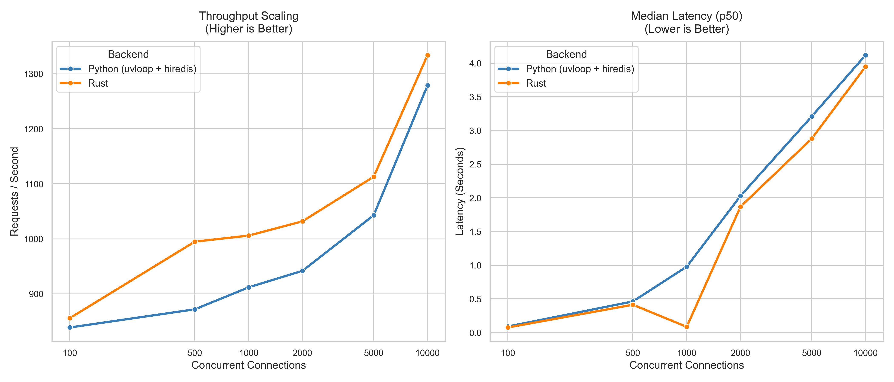

Rustgate Backend
=================

Small FastAPI backend that uses a Rust pyo3 extension for AI token-aware rate
limiting backed by Redis.

Summary
-------
This repository contains two parts:
- `bindings/` -- a Rust crate that exposes Python bindings via pyo3/maturin
- `backend/` -- a small FastAPI app that loads the compiled extension and serves
  a few endpoints

The Rust extension uses the axum-rate-limiter crate and OpenAI's tiktoken-rs to
count query tokens. Rate limits are applied per model and per sliding window,
using the query's estimated token count multiplied by a model-specific cost
factor.

Prerequisites
-------------
- Rust toolchain (rustc/cargo)
- Python 3.10+
- uv (the uv dependency manager)
- Redis (running on default port 6379, or configure with RUSTGATE_REDIS_URL)

Quick Start
-----------
1. Ensure uv is installed and available on PATH.

2. Install dependencies and build everything via uv:

   `uv sync`

   "uv sync" installs pinned dependencies from uv.lock and runs the build steps
   for this repository, including building the Rust pyo3 extension and
   installing the local Python package into the environment uv manages.

Run the server
--------------
After `uv sync` completes you can start the FastAPI server with uv:

    uv run uvicorn main:app --app-dir src --host 127.0.0.1 --port 8001

This uses the environment and commands declared in the repo's uv configuration.

Environment
-----------
- RUSTGATE_REDIS_URL -- redis connection string used by the rate limiter
  (default: redis://127.0.0.1:6379/0)

API Endpoints
-------------
All POST endpoints accept a JSON body with a `query` field, parsed by the Rust
layer for token counting.

- `GET /health` -- basic health check, returns `{"status": "ok"}`

- `POST /models/auto` -- tries gpt-5 first, falls back to gpt-4 if rate limited.
  Returns `{"model": "<model_name>"}`.

- `POST /models/gpt-5` -- attempts to use gpt-5. Returns 429 if rate limited.

- `POST /models/gpt-4` -- attempts to use gpt-4. Returns 429 if rate limited.

Rate Limiting
-------------
Rate limits are enforced in Rust via the `RedisAiLimiter` (axum-rate-limiter
crate) with the following rules:

- **Sliding window**: 10 minutes (600 seconds).
- **Total budget**: 5000 charge units per window per client, identified by IP
  (X-Forwarded-For or remote address).
- **Per-token cost**:
  - gpt-4 family: 1 charge unit per token
  - gpt-5 family: 25 charge units per token
- **Token counting**: uses tiktoken-rs with the appropriate tokenizer
  (Cl100kBase for gpt-4, O200kBase for gpt-5).
- **Zero-token queries**: bypass rate limiting entirely.

Example: a 200-token gpt-5 query costs 5000 charge units (200 x 25), consuming
the entire budget. The same 200-token query against gpt-4 costs only 200 charge
units (200 x 1).

Supported models
----------------
The Rust layer supports two model families:
- `gpt-4` and `gpt-4.*` (e.g. gpt-4, gpt-4.1)
- `gpt-5` and `gpt-5.*` (e.g. gpt-5, gpt-5.4)

Models like `gpt-4o`, `gpt-4o-mini`, `gpt-5-mini`, or `o3` are not currently
supported and will return a 400 error.

Benchmark
---------
Load tests run with [oha](https://github.com/hatoo/oha) against
`POST /models/auto` (token-aware rate limiting) and `GET /health` (baseline),
comparing the Python (`py`) and Rust (`rust`) backends.

Test setup (run from `scripts/`):

    ./benchmark.sh <REMOTE_HOST> py churn

Each concurrency level runs for 30 s with `--disable-keepalive` (churn mode)
and a 70 s cool-down between runs.

### POST /models/auto (rate-limited endpoint)

| Connections | Backend | Requests/sec | Avg latency | p50      | p99      | Success rate |
|-------------|---------|--------------|-------------|----------|----------|--------------|
| 100         | py      | 839          | 119.35 ms   | 90.41 ms | 460.57 ms| 100.00%      |
| 100         | rust    | 856          | 104.60 ms   | 75.70 ms | 717.00 ms| 100.00%      |
| 500         | py      | 872          | 579.50 ms   | 462.30 ms| 1.88 s   | 100.00%      |
| 500         | rust    | 995          | 505.40 ms   | 413.40 ms| 1.45 s   | 100.00%      |
| 1000        | py      | 912          | 1.11 s      | 978.70 ms| 2.67 s   | 100.00%      |
| 1000        | rust    | 1006         | 101.10 ms   | 85.20 ms | 272.20 ms| 100.00%      |
| 2000        | py      | 942          | 2.20 s      | 2.03 s   | 3.97 s   | 100.00%      |
| 2000        | rust    | 1032         | 1.99 s      | 1.87 s   | 3.39 s   | 100.00%      |
| 5000        | py      | 1043         | 4.01 s      | 3.21 s   | 18.06 s  | 95.96%       |
| 5000        | rust    | 1113         | 3.97 s      | 2.88 s   | 20.46 s  | 98.80%       |
| 10000       | py      | 1279         | 5.30 s      | 4.12 s   | 24.55 s  | 87.90%       |
| 10000       | rust    | 1334         | 5.22 s      | 3.95 s   | 21.74 s  | 89.75%       |

At 5000+ connections both backends begin hitting OS/connection limits;
the Rust backend sustains a higher success rate under extreme load.

### GET /health (baseline, no rate limiting)

| Backend | Requests/sec | Avg latency | p50      | p99      |
|---------|--------------|-------------|----------|----------|
| py      | 3330         | 30.02 ms    | 26.98 ms | 67.32 ms |
| rust    | 3103         | 32.17 ms    | 27.05 ms | 129.17 ms|

The health endpoint bypasses all rate limiting and token counting, giving a
raw throughput ceiling for comparison.

